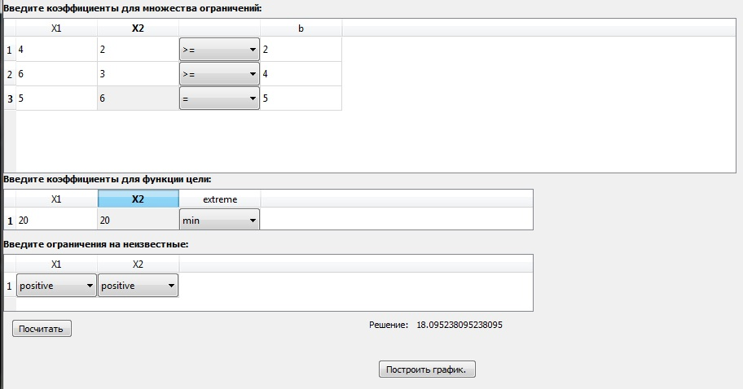
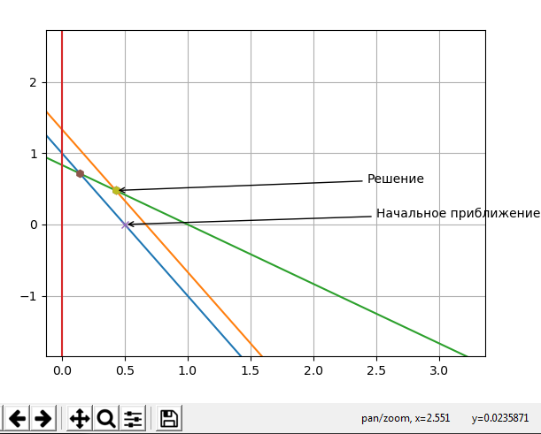

# Reference in Russian
Это приложение для решения задачи линейного программировани симплекс-методом.
## Требования
- Python 3.6-3.8
- пакеты, указанные в `requirements.txt`
## Установка, запуск, удаление
- создайте копию репозитория: `git clone https://gitlab.com/Brahialis0209/gui-qt.git`
- откройте папку `gui-qt` как проект PyCharm и запустите `src/main.py`
либо, находясь в папке `gui-qt/src`, исполните команду: `python main.py`
## Работа с приложением
- Сперва нужно выбрать число строк(число ограничений), число переменных и нажать `Ввести`.
- Далее предлагается ввести коэффициенты для множества ограничений, для функции цели и ограничения на неизвестные, 
 колонка `extreme` отвечает за максимизацию или минимизацию вашей целевой функции.
- Далее, если вы ввели данные корректно, нажмите `Посчитать`.  В случае, если ввод был некорректным(буква вместо числа) -
  вы получите сообщение об ошибке и о том где именно был непраильный ввод.
- При корректных данных вы получите ответ.
- Также, если размерность задачи = 2, (две переменные) то приложение предложит построить график итераций 
  при нахождении оптимального решения.
- Для увеличения изображения используйте лупу в панели.
### Пример
#### Следующая задача была взята как пример
 
#### Тут можно увидеть начальное приближение а также
2 опорных решения, расположенных на многограннике ограничений

